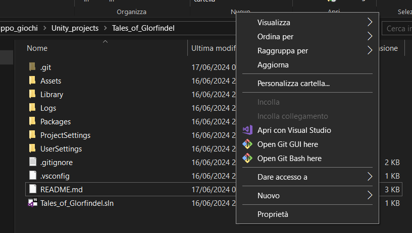

# Tales_of_Glorfindel
## Il gioco
### Preambolo
L'idea di questo gioco nasce nel 2023, quando la Francesca Severone ha deciso di assegnare i famigerati compiti delle vacanze di informatica.
A due ragazzi e unə ragazzə è venuta l'idea di fare le cose in grande: fare un'avventura testuale RPG e tappando le falle con il nastro isolante
producono un gioco abbastanza funzionante in C++ utilizzando, sapendo a malapena cosa sia, la programmazione a oggetti.
Nel 2024, la Lucia Polidori decide di far lavorare gli studenti: assegna ancora i compiti delle vacanze. Dopo aver visto infranti i sogni di
sviluppare un gioco nell'intero mese di Maggio, i nostri eroi decidono di usare l'estate e puntare ancora più in alto: sviluppare con Unity, con Git 
e GitHub. Ma, essendo dei scarsi artisti, si avvalgono dell'aiuto di Tvalia e del fair use degli assets su internet.
E così, ci avviammo verso la fine del nostro gioco.
Sviluppato da Davide Carraro, Andrea Bernacchi e Guglielmo Grossi, con il contributo grafico di Luca Bralia.
### Cosa è

## Guida per sviluppare
Questo documento ha come scopo dare le linee guida per sviluppare il gioco, in maniera abbastanza sintetica
### Lista comandi
#### Comandi utili della Bash
 - pwd: ti dice la tua posizione nel filesystem
 - ls -a: lista tutti i file e le directory presenti dove ti trovi
 - cd \<nomeDirectory>: cambia la directory in cui ci si trova con nomeDirectory (se esiste)
 - touch \<nomeFile>: crea un file vuoto chiamato nomeFile
#### Comandi utili del CMD
- echo %cd%: ti dice la tua posizione nel filesystem
- dir: lista tutti i file e le directory presenti dove ti trovi
- cd \<nomeDirectory>: cambia la directory in cui ci si trova con nomeDirectory (se esiste)
#### Comandi di Git
- git init: inizializza un repository vuoto nella cartella in cui ci si trova
- git remote add \<nomeRepository> \<linkRepository>: aggiunge tra i repository remoti uno che si trova a linkRepository, chiamandolo nomeRepository
- git status: mostra lo stato del repository, quindi i file da committare
- git add: \<nomeFile>: aggiunge il file nomeFile tra quelli da considerare nel prossimo snapshot del progetto
	- git add .: aggiunge tutti i file modificati tra quelli da considerare nel prossimo snapshot del progetto
- git rm --cached \<nomeFile>: rimuove il file nomeFile tra quelli da considerare nel prossimo snapshot del progetto
- git commit -m "messaggio": fa uno snapshot del progetto allo stato attuale, con un messaggio significativo e conciso
- git pull \<nomeRepository> \<nomeBranch>: aggiorna il repository locale con i nuovi progressi trovati su nomeRepository nel branch specificato
- git push \<nomeRepository> \<nomeBranch>: manda al repository remoto nomeRepository sul branch nomeBranch le modifiche del repository locale
### Flusso di lavoro
- Fase iniziale:
	- Andare nella directory dove si trova il progetto e aprire git. È possibile farlo da terminale o con l'esplora file e premere tasto destro
	
	- Fare il comando git pull origin master (git può essere lasciato aperto)
	- Aprire il progetto direttamente con Unity
- Fase intermedia:
	- Lavoro sul progetto. Se si fanno modifiche grandi e varie, è consigliato fare più di una commit, anziché una alla fine. A scelta
	- Fare git add . per aggiungere nel prossimo salvataggio tutti i file modificati
	- Fare git commit -m "Un messaggio pieno di significato" per creare il salvataggio
	- Se non si finisce di lavorare, è possibile continuare dopo, anche senza fare la commit o pushare
- Fase finale
	- Una volta fatte tutte le commit e si decide di finire il lavoro, chiudere il progetto da Unity
	- Fare il comando git push origin master
		- Se va tutto a buon fine, bene
		- Invece, se git vi dice no perché su origin ci sono altre modifiche che voi non avete, allora fate git pull origin master
			- Se tutto va a buon fine, bene. Ora potete fare git push origin master
			- Altrimenti dovete risolvere i conflitti, aprite col vostro editor di testo i file conflittati e decidete cosa tenere
			- Una volta risolti i conflitti potete fare git commit -m "Messaggio" e git push origin master
	- Chiudere git
### Linee guida di programmazione
- I nomi delle classi devono essere scritti in PascalCase, quindi prima lettera maiuscola e solo lettere dell'alfabeto
- Nomi delle variabili:
	- Nomi sensati e significativi, anche se sono un po' lunghi (usate il buonsenso). Quindi myVar o aA non vanno bene, enemyDexterity sì
	- Utilizzate il camelCase, quindi lettere dell'alfabeto e ogni parola ha una lettera maiuscola, tranne la prima
- I nomi delle funzioni devono utilizzare lo snake_case, quindi tutte lettere minuscole e _ al posto degli spazi